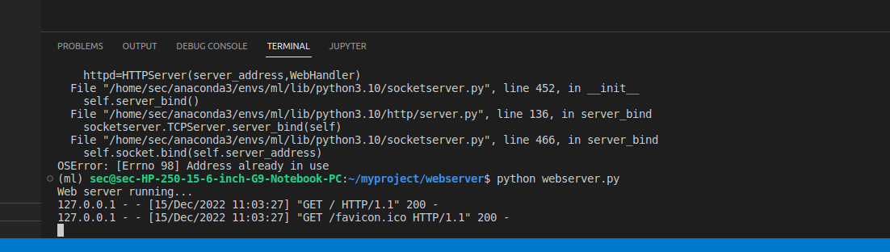
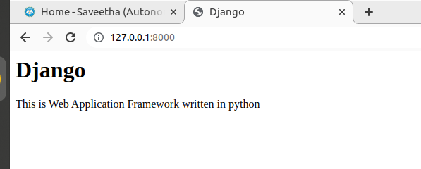

# Developing a Simple Webserver

# AIM:
git pull
To develop a simple webserver to serve html programming pages.

## DESIGN STEPS:

### Step 1:

HTML content creation is done

### Step 2:

Design of webserver workflow

### Step 3:

Implementation using Python code

### Step 4:

Serving the HTML pages.

### Step 5:

Testing the webserver

## PROGRAM:
```
rom http.server import HTTPServer,BaseHTTPRequestHandler

content ="""
<html>
<body>
<title>Django</title>
</head>
<body>
<h1>Django</h1>
<p>This is Web Application Framework written in python</p>

</body>
</html>
"""

class WebHandler(BaseHTTPRequestHandler):
    def do_GET(self):
        self.send_response(200)
        self.send_header('content-type','text/html; charset=utf-8')
        self.end_headers()
        self.wfile.write(content.encode())
    
server_address=('',8001)
httpd=HTTPServer(server_address,WebHandler)
print("Web server running...")
httpd.serve_forever()         
```


## OUTPUT:

### Server side output

###Client side output



## RESULT:
The program is executed succesfully
